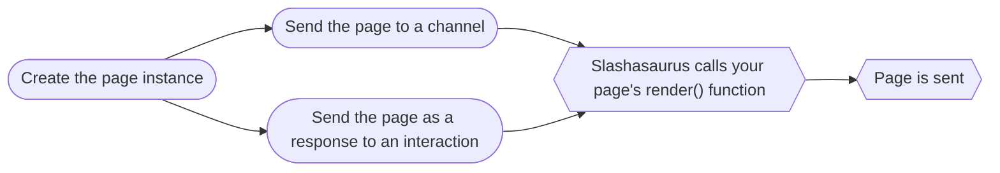
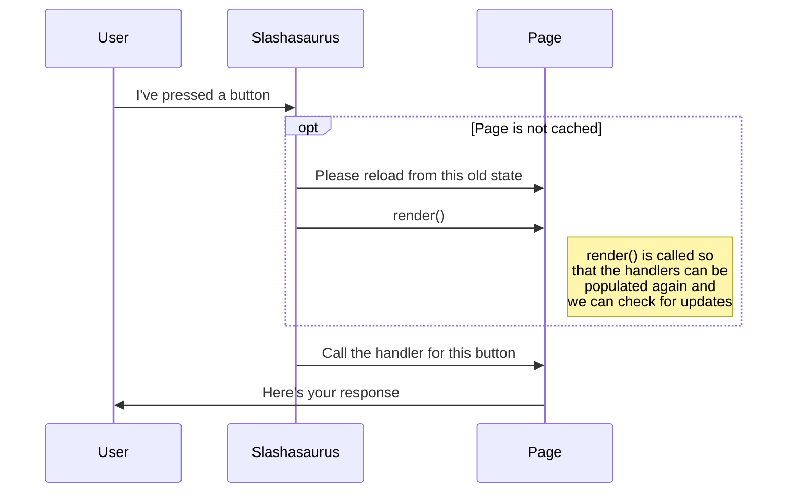
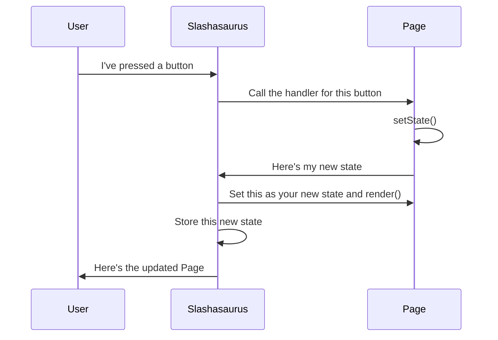

<div align="center">
  <br />
  <h1>Slashasaurus</h1>
  <br />
  <p>
    <a href="https://discord.gg/hqtbXzry3h"></a>
    <a href="https://www.npmjs.com/package/slashasaurus"></a>
  </p>
</div>

## About

Slashasaurus is a command framework built on top of Discord.js. It's inspired by React and Next.JS, so if you've used either before, this will feel kinda familiar to you.

It is _strongly_ recommended that you use [TypeScript](https://www.typescriptlang.org/) with this library, however, it is not a requirement. The quick start is written in TypeScript, most information should be very similar for vanilla JS.

## Table of Contents

- [Installation](#installation)
- [Latest Changelogs](#latest-changelogs)
  - [0.4.1](#041)
  - [0.4.0](#040)
  - [0.3.0](#030)
  - [0.2.0](#020)
  - [0.1.0](#010)
- [Usage](#usage)
- [Creating your first commands](#creating-your-first-commands)
  - [A Command With Arguments](#a-command-with-arguments)
  - [A Command With Choices](#a-command-with-choices)
  - [A Command With Autocomplete](#a-command-with-autocomplete)
  - [A Command With Subcommands](#a-command-with-subcommands)
  - [Creating a Context Menu Command](#creating-a-context-menu-command)
- [Pages](#pages)
  - [Our First Page](#our-first-page)
  - [Using tsx with Pages](#using-tsx-with-pages)
  - [Where to go from here?](#where-to-go-from-here-)
- [Conclusion](#conclusion)

## Installation

To start a new project with Slashasaurus, you need to install discord.js as well as slashasaurus.

```sh
npm install --save discord.js slashasaurus

# or

yarn add discord.js slashasaurus
```

See [discord.js's readme](https://github.com/discordjs/discord.js#optional-packages) for more info about optional packages.

## Latest Changelogs

### 0.4.2

- A couple small fixes when detecting whether or not a Page was updated after a reload from persistent storage.
  - Specifically dealing with emoji and labels in buttons and colors in embeds

### 0.4.1

- A couple small fixes when detecting whether or not a Page was updated after a reload from persistent storage.
- Added support for using `{condition && ...}` inside jsx.

### 0.4.0

Added support for specifying an `onAutocomplete` handler for autocomplete args. This allows for easily re-usable autocomplete handlers for things that may be common across multiple commands in your bot.

### 0.3.0

Added TSX support, see the end of the Pages section for details

### 0.2.0

Pages are ready to be used. They'll take a little bit to get used to, but they're very powerful. Keep in mind, slashasaurus is still in beta and interfaces may change a bit before it's stable.

### 0.1.0

This is the first release of the library, and it is a _beta_ release. Things aren't quite fully done yet and this library still needs to be tested in the wild. I would not recommend porting a large bot to this quite yet. The APIs aren't likely going to get any major changes, but the library internally isn't in a super stable state. Currently it mainly supports slash commands and context menu commands. There's still more planned ahead (especially with message components 👀). There is some extra stuff related to those upcoming features in the library, feel free to take a peek, but they aren't ready quite yet.

## Usage

To start, create your index file and make an instance of the client.

```ts
// index.ts
import { Intents } from 'discord.js';
import path from 'path';
import { SlashasaurusClient } from 'slashasaurus';

const client = new SlashasaurusClient(
  {
    intents: [Intents.FLAGS.GUILDS],
    restRequestTimeout: 30 * 1000,
  },
  {
    devServerId: '561807594516381749',
  }
);
```

The first argument is the same options object you would pass to a discord.js client, [see their docs for more info](https://discord.js.org/#/docs/discord.js/stable/typedef/ClientOptions). The second argument is the options for Slashasaurus. The only required argument is the id of your development server. This is used by the client to register commands to during testing.

Now we need to register our commands with the bot and log in. Don't worry yet about where the commands are, we'll get to that next.

```ts
// index.ts
client.once('ready', () => {
  logger.info(`Client ready and logged in as ${client.user?.tag}`);
  client.registerCommandsFrom(
    path.join(__dirname, '/commands'),
    process.env.NODE_ENV === 'development' ? 'dev' : 'global'
  );
});

client.login(process.env.TOKEN);
```

Once the bot starts up, you'll want to call `client.registerCommandsFrom`. This takes in the path to the folder that contains all your commands as well as how you want the bot to register the commands with discord.

When developing your bot, you can pass "dev" and it will register the commands as guild commands to your development server, that way they update right away.

If your bot is running in production, you can pass "global" and it will register the commands as global commands.

OR

You can pass "none" and this will skip registering the commands with discord, this is especially useful when your bot has multiple shards, that way you wont attempt to register the commands multiple times on startup.

## Creating your first commands

Slashasaurus uses a special folder structure for slash commands that is similar to routes in Next.JS. If you followed the code above, you'll want to put a folder named `commands` in the same location as your index file. Your folders should look something like this

```
my-bot
├─ src
│  ├─ index.ts
│  └─ commands
│
├─ tsconfig.json
├─ README.md
└─ package.json
```

Lets make a generic `ping` slash command first. First, we need to add a folder inside commands named `chat`, this will hold all of our slash commands in it. And add `ping.ts` inside there.

```
my-bot
├─ src
│  ├─ index.ts
│  └─ commands
│     └─ chat
│        └─ ping.ts
│
├─ tsconfig.json
├─ README.md
└─ package.json
```

Inside `ping.ts`, we'll write our first SlashCommand. What we need to do is create the command and export it as default.

```ts
// ping.ts
import { SlashCommand } from 'slashasaurus';

export default new SlashCommand(
  {
    name: 'ping',
    description: 'Pings the bot to make sure everything is working',
    options: [],
  },
  {
    run: (interaction) => {
      interaction.reply({
        content: `Pong!`,
        ephemeral: true,
      });
    },
  }
);
```

You'll notice that SlashCommand takes two arguments. The first one is the details of the command: name, description, options, and also the defaultPermissions if you want to specify it. We'll get to the options later as there's some cool stuff there.

The second argument is your handlers, first is the run handler that's called when the command is run. This function receives the [interaction](https://discord.js.org/#/docs/discord.js/stable/class/CommandInteraction), the client, and the options which I'll elaborate on more in a minute. The other handler is the autocomplete handler which will be explained later as well.

### A Command With Arguments

Now that we have a basic command with no arguments, lets make another one to take a look at a command with options.

Create a new file in the `chat` folder named `hello.ts`.

```
my-bot
├─ src
│  ├─ index.ts
│  └─ commands
│     └─ chat
│        ├─ hello.ts
│        └─ ping.ts
│
├─ tsconfig.json
├─ README.md
└─ package.json
```

In here we'll make a command that asks for the user's name and says hello.

```ts
// hello.ts
import { SlashCommand } from 'slashasaurus';

export default new SlashCommand(
  {
    name: 'hello',
    description: 'Makes the bot greet you',
    options: [
      {
        type: 'STRING',
        name: 'name',
        description: 'Your name',
        required: true,
      },
    ] as const,
  },
  {
    run: (interaction, client, options) => {
      interaction.reply({
        content: `Hello, ${options.name}. Nice to meet you!`,
        ephemeral: true,
      });
    },
  }
);
```

Now you will likely notice something a little weird in here that you probably haven't seen before. What's with this `as const` thing after the options? This does a special thing to the type of the options being passed into the SlashCommand. This is what powers the type of `options`. If you want specifics, you can look at the code here, or ask me about it on Discord. (If you're using JavaScript, it will give you an error on this code. Just remove it, the library will still function perfectly fine)

If we take a look at our handler, we can see that this time we're using the `options` object, and we can get the value of the `name` option by just using `options.name`. The bread and butter of this library (and also what this started as a proof of concept for) is giving you a really easy to work with `options` object. Unlike dealing with a raw CommandInteraction, you don't need to use `getString("name")`, it lives right on the options object, easy to use. If you're using TypeScript you'll also now notice that `options.name` will autocomplete with the correct type. This works for _all_ options types currently available. Just specify the name and type and the library will handle the rest.

### A Command With Choices

Lets take a look at building out a command with a string argument with a provided set of `choices` for the user.

Create a file called `survey.ts` in the same place as last time.

```
my-bot
├─ src
│  ├─ index.ts
│  └─ commands
│     └─ chat
│        ├─ hello.ts
│        ├─ ping.ts
│        └─ survey.ts
│
├─ tsconfig.json
├─ README.md
└─ package.json
```

In there we'll make our new command:

```ts
// survey.ts
import { SlashCommand } from 'slashasaurus';

export default new SlashCommand(
  {
    name: 'survey',
    description: 'Give a response for our survey',
    options: [
      {
        type: 'STRING',
        name: 'language',
        description: 'What language do you use?',
        required: true,
        choices: [
          {
            name: 'JavaScript',
            value: 'js',
          },
          {
            name: 'TypeScript',
            value: 'ts',
          },
        ] as const,
      },
    ] as const,
  },
  {
    run: (interaction, client, options) => {
      if (options.language === 'js') {
        interaction.reply({
          content: `We've recorded your response. (also try TypeScript)`,
          ephemeral: true,
        });
      } else {
        interaction.reply({
          content: `We've recorded your response. (also try JavaScript)`,
          ephemeral: true,
        });
      }
    },
  }
);
```

Again you'll see the `as const` after the array of choices. This does the same thing with the types to help keep the autocomplete helpful. When you look at the type of `options.language` you'll see it's `"js" | "ts"` this means that you'll know exactly what the options are that the user has, instead of needing to remember them or scroll back and check. If you happen to notice that it's just typed as `string` this likely means you forgot the second `as const`.

### A Command With Autocomplete

Before we move on we should take a look at autocomplete options.

Make a new file `longsurvey.ts`:

```
my-bot
├─ src
│  ├─ index.ts
│  └─ commands
│     └─ chat
│        ├─ hello.ts
│        ├─ ping.ts
│        ├─ longsurvey.ts
│        └─ survey.ts
│
├─ tsconfig.json
├─ README.md
└─ package.json
```

In here we'll make our command:

```ts
// longsurvey.ts
import { SlashCommand } from 'slashasaurus';

const foods = ['cheese', 'apples', 'oranges', 'burgers', 'bacon', 'fish'];

export default new SlashCommand(
  {
    name: 'longsurvey',
    description: 'Give a response for our other survey',
    options: [
      {
        type: 'STRING',
        name: 'food',
        description: 'Which of these foods is your favorite?',
        required: true,
        autocomplete: true,
      },
    ] as const,
  },
  {
    run: (interaction, client, options) => {
      interaction.reply({
        content: `We've recorded your response of ${options.food}.`,
        ephemeral: true,
      });
    },
    autocomplete: (interaction, focusedName, focusedValue, client, options) => {
      if (focusedName === 'food') {
        interaction.respond(
          foods.filter((food) => food.startsWith(focusedValue))
        );
      }
    },
  }
);
```

Here we have our second handler, `autocomplete`. This handler is given the autocomplete interaction, the name of the field that's being filled out, the value the user has entered so far, the client, and finally the options again. The `focusedName` will only ever be one of the options with autocomplete set to true, so in this case it's type is `"food"`, but if we had another it would be a union of the two, for instance: `"food" | "other"`.

> :warning: Optionally, you can specify `onAutocomplete` inside your `food` option, this function will receive `interaction`, `value`, and `client`. If you pass this handler, all autocomplete interactions related to this arg will call that function _instead_ of the `autocomplete` inside your handlers. This is extra useful when you have a specific autocomplete that's used across multiple commands, for instance autocompleting the name of something in a search, etc.

### A Command With Subcommands

Lastly, lets take a look at how we make subcommands. Lets make a `/role add` and a `/role remove`.

First, make a new folder called `role` where you other commands are, then add an `add.ts` and a `remove.ts` inside.

```
my-bot
├─ src
│  ├─ index.ts
│  └─ commands
│     └─ chat
│        ├─ hello.ts
│        ├─ ping.ts
│        ├─ longsurvey.ts
│        ├─ role
│        │  ├─ add.ts
│        │  └─ remove.ts
│        │
│        └─ survey.ts
│
├─ tsconfig.json
├─ README.md
└─ package.json
```

With this one I won't show the exact commands since that isn't necessary to illusatrate the point. Here you'll see that making subcommands is almost the same as making top level commands. Just place them inside the folder and the top level command will use the folder name as its name. If you want to specify a description for the top level command you can create a file inside the folder named `_meta.ts`. You can export a `description` and `defaultPermissions` to set those on that command. For instance we can make the `_meta.ts` file:

```
my-bot
├─ src
│  ├─ index.ts
│  └─ commands
│     └─ chat
│        ├─ hello.ts
│        ├─ ping.ts
│        ├─ longsurvey.ts
│        ├─ role
│        │  ├─ _meta.ts
│        │  ├─ add.ts
│        │  └─ remove.ts
│        │
│        └─ survey.ts
│
├─ tsconfig.json
├─ README.md
└─ package.json
```

and put:

```ts
// _meta.ts
export const description = 'Commands for managing your roles';
```

Now our top level `/role` command will have that description.

### Creating a Context Menu Command

Now lets make a quick context menu command to finish off our options. Here we'll need to make a new folder next to our `chat` folder. Let's make a message context menu command that mocks the message.

Create our new folder named `message` and put `mock.ts` in it:

```
my-bot
├─ src
│  ├─ index.ts
│  └─ commands
│     ├─ chat
│     │  ├─ hello.ts
│     │  ├─ ping.ts
│     │  ├─ longsurvey.ts
│     │  ├─ role
│     │  │  ├─ _meta.ts
│     │  │  ├─ add.ts
│     │  │  └─ remove.ts
│     │  │
│     │  └─ survey.ts
│     │
|     └─ message
│        └─ mock.ts
│
├─ tsconfig.json
├─ README.md
└─ package.json
```

In the file we'll make our new context menu command:

```ts
import { MessageCommand } from 'slashasaurus';

export default new MessageCommand(
  {
    name: 'Mock',
  },
  (interaction, _client) => {
    const content = interaction.targetMessage.content;
    interaction.reply({
      content: content
        .split('')
        .map((letter, index) =>
          index % 2 === 0
            ? letter.toLocaleLowerCase()
            : letter.toLocaleUpperCase()
        )
        .join(''),
      ephemeral: true,
    });
  }
);
```

Here we make a MessageCommand and export it as default. All we need to do is give it a name and a run handler and we're all good to go!

## Pages

Pages are a new way to think about message components. Right now you probably handle them thinking about what each button or select does and trying to write handlers and crazy stuff with custom ids. Pages take that method and turn it on it's head. Instead of thinking about individual components, you think about the message as a whole. And rather than needing to track potentially a dozen different components with custom ids on a message, you just pass the handlers you want and slashasaurus handles the rest.

**Before we get started, though, a couple things to think about:**

One, Pages are _not_ recommended for every use case of message components. Pages do take up a bit of memory and can be slower than just a normal handler. Something like button roles would _not_ be the ideal use of Pages, it's a very static message that doesn't need to store much state. The ideal use for Pages is something like search results where there's potentially multiple pages of results and users can scroll through them. Or maybe something like an initial setup where a user will go through a few sets of settings to get things configured.

Two, old messages have _much_ higher ratelimits on being updated. If you have a highly interactive page that updates often, you may want to prompt the user to re-open the page (or resend the Page automatically) if the message is old when they interact with it.

Let's take a look at a couple examples to see what we can do with Pages.

### Our First Page

Before we begin, let's make a mental model of how Pages work so that you can have some context to what each piece is for. First you'll make an instance of a page and send it to a channel.



Now that the page has been sent the user will begin to interact with it:



With the interaction being passed to your handler, you may want to choose to update the state of your Page:



Now that you have a bit of a mental model of what's going on, there's a little bit of setup we need to do. First, we need to give slashasaurus a way to store the state of these pages long term. We do this by passing a couple new function into the client constructor, `storePageState` and `getPageState`. These two functions will interface with _any_ persistent storage system you want. This could be redis, postgres, even a JSON file (although that's not recommended).

```ts
// index.ts
const client = new SlashasaurusClient(
  {
    // discord.js options...
  },
  {
    // other slashasaurus options...
    storePageState: async (messageId, pageId, stateString, messageData) => {
      storage.store(messageId, {
        pageId,
        stateString,
        messageData,
      });
    },
    getPageState: async (messageId) => {
      return storage.get(messageId);
    },
  }
);
```

The `storePageState` function receives 4 props: `messageId`, which will be used as the key, and 3 more strings which aren't important to know right now, but all need to be stored and retreived by this messageId. The `getPageState` function need to return the three strings as an object.

We can also pass a `pageTtl` to change how long Pages will stay in the cache.

Next, we need to add a new folder to store all our pages in. These pages will be registered with the client, just like our commands, so that they can be used to load pages from the persistent storage.

```
my-bot
├─ src
│  ├─ index.ts
│  ├─ commands
│  └─ pages
│
├─ tsconfig.json
├─ README.md
└─ package.json
```

Then we'll tell the client to register the pages from that folder.

```ts
// index.ts...
client.registerPagesFrom(path.join(__dirname, '/pages'));
```

Now we'll move on to actually making our first Page.

This one will be a little simple an useless, just as a way to get the hang of things before we move on to something more complex. We'll make a simple Page with just one button and a little bit of state.

Before you begin working on your Page you'll need to think about what your props and your state. The props for this first page will be nothing, since no matter how the page gets created there wont need to be anything passed in. We'll place this in a new file in the pages folder.

```
my-bot
├─ src
│  ├─ index.ts
│  ├─ commands
│  └─ pages
│      └─ toggle.ts
│
├─ tsconfig.json
├─ README.md
└─ package.json
```

In here we'll put the class for this page as well as a couple other things. We'll start by modeling how the state of our Page will look. In this case we only need one property in our state and that's whether or not the toggle is on or off. So we'll declare a new interface with this property.

```ts
// toggle.ts
interface TogglePageState {
  on: boolean;
}
```

Now we need to get started with writing our actual Page. If you've used React before, this may seem a little familiar. We'll start by exporting a new class as default. This class will extend Page, and as part of the generics we'll pass `{}` for our props since we don't have any, and then we'll pass our interface we just made for the state.

```ts
// toggle.ts
import { Page } from 'slashasaurus';

interface TogglePageState {
  on: boolean;
}

export default class TogglePage extends Page<{}, TogglePageState> {}
```

Now we need to setup the constructor so that we can set the initial state of the Page. Here we'll take in the props of our Page and pass them to the `super` call, then we'll set the initial state of our page by assigning to `this.state`.

```ts
// toggle.ts
import { Page } from 'slashasaurus';

interface TogglePageState {
  on: boolean;
}

export default class TogglePage extends Page<{}, TogglePageState> {
  constructor(props: {}) {
    super(props);
    this.state = {
      on: false,
    };
  }
}
```

Next we'll need to give our Page an ID. This will be used to get the Page from our registry whenever it needs to be loaded from the long-term storage. To do this we need to declare a static property on the class named `pageId` and assign it a _unique_ id.

```ts
// toggle.ts
// ...
export default class TogglePage extends Page<{}, TogglePageState> {
  static pageId = 'toggle';

  constructor(props: {}) {
    super(props);
    this.state = {
      on: false,
    };
  }
}
```

> ⚠️ Be careful with the pageId you use for your Page. This will be how slashasaurus looks things up _forever_, so if you re-use a pageId later down the line you may end up with some unexpected data coming through to this new page.

Ok, so this is definitely a bit of setup here before we can finish this Page, but it's all important and we have just one thing left to do. We need to have a way to serialize the state of this Page so that it can be stored easily. First we'll define our `serializeState` function inside the Page.

```ts
// toggle.ts
// ...
export default class TogglePage extends Page<{}, TogglePageState> {
  static pageId = 'toggle';

  constructor(props: {}) {
    super(props);
    this.state = {
      on: false,
    };
  }

  serializeState() {
    return JSON.stringify(this.state);
  }
}
```

In this case it's relatively simple, we can just call JSON.stringify on our state. If you have something more complex like users, channels, guilds, or something from your database in the state, you can instead store just the id of the object and when it gets deserialized, you can pull the object from djs or the database.

> ⚠️ This function will also need to serialize the props, if your page has any, so that they'll also be accessible when deserializing this Page.

Now we need a way to deserialize the Page. We'll export a new function named `deserializeState`. You can type this with `DeserializeStateFn` to get the autocomplete while you work on this.

```ts
// toggle.ts
import { DeserializeStateFn, Page } from 'slashasaurus';

// ...

export const deserializeState: DeserializeStateFn<{}, TogglePageState> = (
  serializedState
) => {
  const state = JSON.parse(serializedState);
  return {
    props: {},
    state,
  };
};
```

Here it's also pretty simple to deserialize our state using just `JSON.parse`. The first prop passed into this function is the string that was returned earlier by the `serializeState` function. There's also a second prop, `interaction` which is whatever interaction triggered this page to "wake up," if there was one.

Sometimes you may need to update how your Page works. This means that some older versions of this Page may still exist. If those older Pages get woken up, this function may receive an older version of the state, so keep that in mind when you write this. There's a couple ways you can handle this:

1. Reply to the interaction, letting the user know how to re-open this Page using whatever command, button press, etc.
   - **This is not the recommended option**, but it can be used as a last resort. If you do this, return an empty object and slashasaurus will delete the original Page message, or edit it to say it's closed and remove all components if it was an ephemeral message.
2. Attempt to convert the older state to the newer version of the state.
   - **This is the recommended option.** If it's something simple where you've added something new to the state, you can try to provide a default value. If something has changed about the structure of the state, you can try to convert it to the newer structure.
   - If the message's content, components, or embeds change, slashasaurus will automatically update the old message to the new version, then prompt the user to redo their action. This way there wont be any unintended outcomes because the user pressed a button that may be handled differently now.

Now that we've finish all the setup, we can finally get to making our actual Page content.

Let's start by importing `PageInteractableButton` from slashasaurus. This is specifically for handling buttons that users can click. If you want a link button you can import `PageLinkButton` instead.

```ts
// toggle.ts
import { DeserializeStateFn, Page, PageInteractableButton } from 'slashasaurus';
```

Now we'll create our `render` function for our Page. This should return a `RenderedPage` which slashaurus will send. In the render function we'll return our new message with the button to toggle the state. A couple things to keep in mind: `render` should _always_ return the same message if the `props` and `state` are the same. Keep in mind the render function may _also_ be called when you aren't always expecting it to. If you need randomness in your message then you should create the random value and pass it as a prop or set it in the state.

```ts
// toggle.ts
import {
  DeserializeStateFn,
  Page,
  PageInteractableButton,
  RenderedPage,
} from 'slashasaurus';

export default class TogglePage extends Page<{}, TogglePageState> {
  render(): RenderedPage {
    return {
      content: `The lights are currently: ${this.state.on ? 'on' : 'off'}`,
      components: [
        [
          new PageInteractableButton({
            handler: this.toggle, // We'll write this function in a second
            label: 'Toggle the lights',
            style: 'PRIMARY',
          }),
        ],
      ],
    };
  }
}
```

Now we just need to create the handler for our button.

```ts
// toggle.ts
export default class TogglePage extends Page<{}, TogglePageState> {
  constructor(props: {}) {
    super(props);
    this.toggle = this.toggle.bind(this);
    this.state = {
      on: false,
    };
  }

  // ...

  async toggle(interaction: ButtonInteraction) {
    interaction.deferUpdate();
    this.setState({
      on: !this.state.on,
    });
  }

  // ...
}
```

In this case we will bind this function with the Page as `this`. If you don't bind it, it can sometimes cause some weird things to happen if you try to use `this` inside your function. The function will be passed one arg, the interaction that triggered it. Here we'll do a `deferUpdate()` on the interaction so that the loading spinner on the button goes away. Then we call `this.setState()` with our new state for this Page. When we call this, slashaurus will automatically set the new state on the page, update the message, and store the new state in your storage (This is done on every state update in case the bot shuts down unexpectedly).

> ⚠️ Do _NOT_ mutate the current state with something like
>
> ```ts
> this.state = {
>   on: false,
> };
> ```
>
> If you change the state like this, slashasaurus will not know that the state changed and will not automatically update the message or store the new state. This can cause the Page's state to get decoupled and lead to weird bugs that are hard to track down.

That's it! This Page is now ready to be used. Let's create a new slash command that will give this user the page.

```
my-bot
├─ src
│  ├─ index.ts
│  └─ commands
│     └─ chat
│        └─ lights.ts
│
├─ tsconfig.json
├─ README.md
└─ package.json
```

```ts
// lights.ts
import { SlashCommand } from 'slashasaurus';
import TogglePage from '../../pages/TogglePage';

export default new SlashCommand(
  {
    name: 'lights',
    description: 'Gives you access to the light switch',
    options: [],
  },
  {
    run: async (interaction, _, _options) => {
      const page = new TogglePage({});
      page.sendAsReply(interaction);
    },
  }
);
```

Here we create a new instance of TogglePage and call `sendAsReply` to reply to the interaction with our brand new Page. You can optionally pass `true` as the second argument to send it as an ephemeral reply. Now this is all ready to go! If you start your bot and run the command, the Page should be sent as the reply and you can click your brand new button.

### Using tsx with Pages

First, in order to use tsx with your Pages, make sure you're using at least version 0.3.0 of slashasaurus. The other thing to keep in mind is that this is TypeScript only at the moment. It uses TypeScript's native tsx functionality to transform the code when transpiling to JS. We'll need to start by adding a couple options to our tsconfig.

```json
// tsconfig.json
{
  // ...
  "compilerOptions": {
    // ...
    "jsx": "react",
    "jsxFactory": "createInteractable",
    "jsxFragmentFactory": "null"
  }
}
```

This will enable TSX support and change it to work with slashasaurus instead of React. Now we can change up how our Page works. In any files where you want to use the tsx, make sure to change the file extension to `.tsx` and import `createInteractable` from slashasaurus. Let's take a look at our TogglePage example from earlier.

Before:

```ts
// toggle.ts
import {
  DeserializeStateFn,
  Page,
  PageInteractableButton,
  RenderedPage,
} from 'slashasaurus';

export default class TogglePage extends Page<{}, TogglePageState> {
  static pageId = 'toggle';

  constructor(props: {}) {
    super(props);
    this.toggle = this.toggle.bind(this);
    this.state = {
      on: false,
    };
  }

  serializeState() {
    return JSON.stringify(this.state);
  }

  async toggle(interaction: ButtonInteraction) {
    interaction.deferUpdate();
    this.setState({
      on: !this.state.on,
    });
  }

  render(): RenderedPage {
    return {
      content: `The lights are currently: ${this.state.on ? 'on' : 'off'}`,
      components: [
        [
          new PageInteractableButton({
            handler: this.toggle, // We'll write this function in a second
            label: 'Toggle the lights',
            style: 'PRIMARY',
          }),
        ],
      ],
    };
  }
}

export const deserializeState: DeserializeStateFn<{}, TogglePageState> = (
  serializedState
) => {
  const state = JSON.parse(serializedState);
  return {
    props: {},
    state,
  };
};
```

After:

```tsx
// toggle.tsx
import {
  createInteractable
  DeserializeStateFn,
  Page,
  PageActionRow,
  PageInteractableButton,
  RenderedPage,
} from 'slashasaurus';

export default class TogglePage extends Page<{}, TogglePageState> {
  static pageId = 'toggle';

  constructor(props: {}) {
    super(props);
    this.toggle = this.toggle.bind(this);
    this.state = {
      on: false,
    };
  }

  serializeState() {
    return JSON.stringify(this.state);
  }

  async toggle(interaction: ButtonInteraction) {
    interaction.deferUpdate();
    this.setState({
      on: !this.state.on,
    });
  }

  render(): RenderedPage {
    return {
      content: `The lights are currently: ${this.state.on ? 'on' : 'off'}`,
      components: (
        <>
          <PageActionRow>
            <PageInteractableButton
              handler={this.toggle}
              label='Toggle the lights'
              style='PRIMARY'
            />
          </PageActionRow>
        </>
      ),
    };
  }
}

export const deserializeState: DeserializeStateFn<{}, TogglePageState> = (
  serializedState
) => {
  const state = JSON.parse(serializedState);
  return {
    props: {},
    state,
  };
};
```

### Where to go from here?

When looking at creating more complex pages, make sure to plan ahead. If you need to make database lookups, do those outside of the constructor and instead pass the object as a prop. If your page starts to get very complex you can try splitting it into multiple pages and use `this.transitionTo(newPage)` to switch out the Page with a new one. If you're worried about storage concerns with page state, you can listen to `messageDelete` events and tell your storage to remove data related to pages on those messages.

## Conclusion

That's it for this (admittedly long) "quick" start guide. If you have any further questions, you can ask in the discord server linked at the top of this README.
